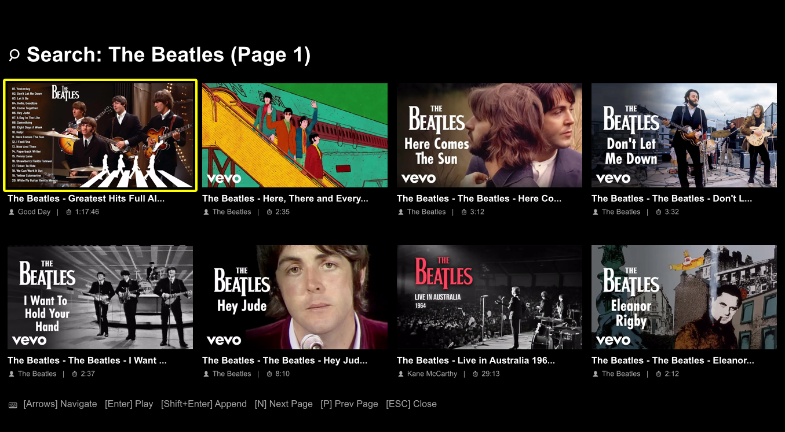
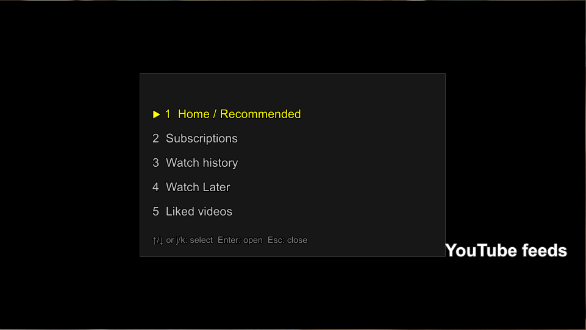
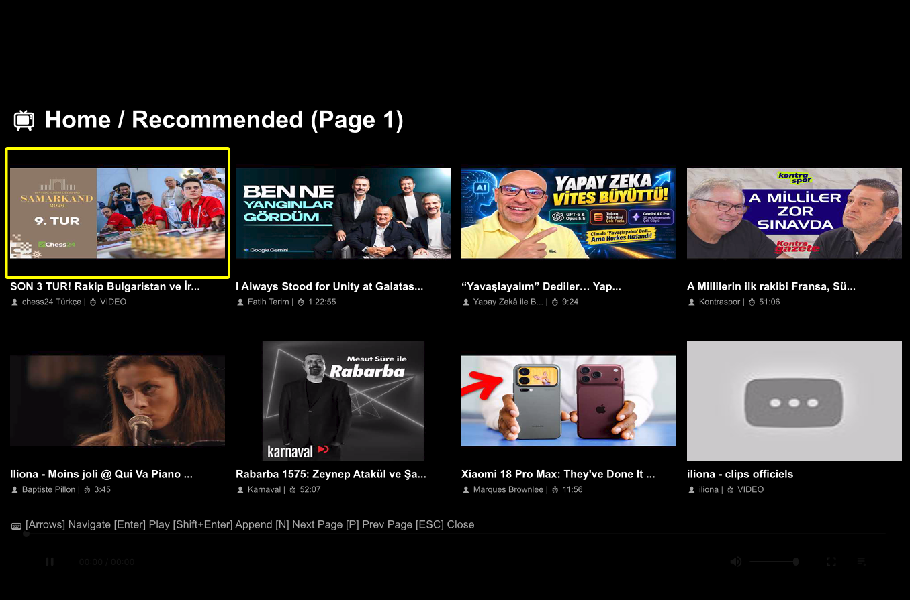

# YouTube Search Select for mpv

A cross‑platform mpv Lua script that searches YouTube with `yt-dlp`, renders a selectable grid with asynchronous thumbnails, and handles playback or playlist appending.

There are two variants in this repo:

- **Basic** – `mpv-youtube-search.lua`  
  Search‑only version, no cookies, works on all systems.
- **Extended** – `mpv-youtube-search-extended.lua`  
  Adds authenticated, personalized feeds (Home, Subscriptions, History, Watch Later, Liked) using Firefox cookies.

---

## Variants

### Basic version – `mpv-youtube-search.lua`

- Search YouTube from mpv.
- Grid UI with thumbnails, pagination, and queueing.
- No login, no cookies, no personalized feeds.



Use this if:

- You only need search.
- You don’t want to deal with cookies or browser integration.
- You’re on a system where cookie extraction is unreliable.

### Extended version – `mpv-youtube-search-extended.lua`

Everything the basic version has, plus:

- Personalized feeds via Firefox cookies:
  - Home / Recommended
  - Subscriptions
  - Watch history
  - Watch Later
  - Liked videos
- Feed menu (`Ctrl+y`) and direct keys (`Ctrl+Shift+h`, `Ctrl+Shift+s`, `Ctrl+Shift+r`, `Ctrl+Shift+w`, `Ctrl+Shift+l`).
- Cookie refresh from Firefox at startup.

> Cookie support currently works reliably only with **Firefox** on Windows and most Linux setups.  
> Chrome/Edge often fail due to OS‑level cookie encryption.

#### Screenshots – Extended version

- Feed selection menu:

  
  
- Home feed:

  

---

## Requirements

Both versions require:

- mpv with Lua script support
- `yt-dlp` installed and available in `PATH` (or configured via options)
- `ffmpeg` installed and available in `PATH` (or configured via options)
- Network access to YouTube

The **extended** version additionally benefits from:

- Firefox installed (for `--cookies-from-browser` cookie refresh).

---

## Installation

1. Choose your variant:
   - Basic: `mpv-youtube-search.lua`
   - Extended: `mpv-youtube-search-extended.lua`
2. Copy the chosen file into mpv’s script directory:
   - **Windows (portable)**: `portable_config/scripts/`
   - **Linux / macOS**: `~/.config/mpv/scripts/`
3. (Optional) Rename it to `mpv-youtube-search.lua` if you only want one version.
4. Restart mpv.

Thumbnail frames are cached inside mpv’s config directory under `~~/ytsearch_bgra/`.

---

## Configuration

Defaults defined at the top of each Lua file (names may differ slightly between variants):

```lua
local opts = {
    yt_dlp_path   = "yt-dlp",
    ffmpeg_path   = "ffmpeg",
    cookie_path   = "~~/cookies.txt",   -- extended only
    browser       = "firefox",          -- extended only
    browser_profile = "",               -- extended only
    page_size     = 8,
    search_key    = "Ctrl+s",
    feed_key      = "Ctrl+y",           -- extended only
}
```

Override via mpv `script-opts`:

- **Windows**: `portable_config/script-opts/mpv-youtube-search.conf`
- **Linux / macOS**: `~/.config/mpv/script-opts/mpv-youtube-search.conf`

Example `.conf` (basic):

```ini
yt_dlp_path=yt-dlp
ffmpeg_path=ffmpeg
page_size=8
search_key=Ctrl+s
```

Example `.conf` (extended):

```ini
yt_dlp_path=yt-dlp
ffmpeg_path=ffmpeg
cookie_path=~~/cookies.txt
browser=firefox
browser_profile=
page_size=8
search_key=Ctrl+s
feed_key=Ctrl+y
```

*(Supports `~~/` path expansion, e.g. `yt_dlp_path=~~/_bin/yt-dlp`.)*

---

## Controls

### Both versions

| Key | Action |
| --- | --- |
| `Ctrl+s` | Open the YouTube search prompt |
| `Up`, `Down`, `Left`, `Right` | Move selection (4‑column grid) |
| `Enter` | Play the selected result (replace) |
| `Shift+Enter` | Append/queue the selected result |
| `N` | Next page |
| `P` | Previous page |
| `Esc` | Close results grid and restore window geometry |

### Extended version only

| Key | Action |
| --- | --- |
| `Ctrl+y` | Open the YouTube feeds menu |
| `Ctrl+Shift+h` | Open Home / Recommended |
| `Ctrl+Shift+s` | Open Subscriptions |
| `Ctrl+Shift+r` | Open Watch history |
| `Ctrl+Shift+w` | Open Watch Later |
| `Ctrl+Shift+l` | Open Liked videos |
| `Up/Down` or `j/k` (in menu) | Select feed |
| `Enter` (in menu) | Open selected feed |
| `Esc` (in menu) | Close menu |

---

## Pagination

Default page size is `8` items (4 columns × 2 rows). Page calculation fetches `page * page_size` items sequentially to prevent offset skipping.

---

## Thumbnails

- Displays `Loading...` asynchronously while fetching/converting.
- Fetches poster via `yt-dlp`, converts to raw BGRA via `ffmpeg` (`320x180`), and caches per page (`<vid_id>_p<page>.bgra`).
- Falls back to `No Image` placeholder vector card if download/conversion fails.

---

## Window Behavior

Target layout dimensions:

```lua
local GRID_WIDTH, GRID_HEIGHT = 1360, 900
```

Non‑fullscreen/non‑maximized windows resize to fit the grid target footprint and restore previous geometry upon closing or playback execution.

---

## Troubleshooting

### Search or feeds fail with status `-2` or subprocess spawn error

- Check binary availability:
  - Windows: `where yt-dlp` / `where ffmpeg`
  - Linux/macOS: `which yt-dlp` / `which ffmpeg`
- If using conda/venv wrappers on Windows, point `yt_dlp_path` directly to the compiled `.exe` or ensure `PATH` inheritance reaches the mpv GUI launcher.

### Thumbnails show `No Image` or stuck on `Loading...`

- Verify `ffmpeg` CLI availability.
- Check write permissions for `~~/ytsearch_bgra`.

### Extended version: feeds show “Feed empty” or “Cookies not available”

- Ensure Firefox is installed.
- Make sure mpv can access your Firefox profile (same user, standard install).
- If cookie refresh fails repeatedly:
  - Try closing Firefox and restarting mpv.
  - Or manually export cookies to a file and set `cookie_path` in the config.

> On Linux, Chrome/Edge cookies may fail if the browser’s keyring is locked or inaccessible. Firefox is currently the most reliable option.

---

## License / Notes

- This project uses `yt-dlp` and `ffmpeg` as external tools.
- No API keys or tokens are hardcoded; authenticated feeds rely solely on your local browser cookies.
- Mix/radio (`RD…`) items are filtered out because they cannot be played reliably as standalone playlists.
